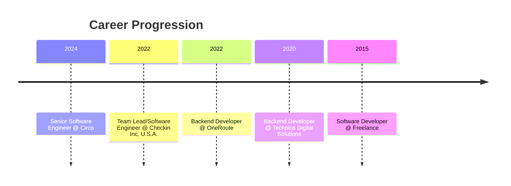

# 
👋 Hi there, I'm Emmanuel!

  
  
  
  
  

## 🚀 About Me

I'm a passionate **Senior Software Engineer** with over 5 years of experience, specializing in building and optimizing robust, scalable software solutions. My expertise spans the **full-stack**, combining deep proficiency in **backend development** with **Node.js** and related technologies, and strong capabilities in modern **frontend frameworks** like React and Next.js.

I thrive on transforming complex challenges into efficient, high-performance systems. My career has been focused on modernizing legacy applications, architecting microservices, and delivering end-to-end solutions that significantly enhance user experience and drive business growth. I am passionate about clean code, continuous learning, and fostering collaborative team environments.

  
  
  

## 🛠️ Tech Stack & **Tools**

<table>
<tr>
<td valign="top" width="33%">

### Frontend  

  
  
  
  
  

</td>
<td valign="top" width="33%">

### Backend  

  
  
  
  
  

</td>
<td valign="top" width="33%">

### DevOps & Cloud  

  
  
  
  
  

</td>
</tr>
</table>

More Skills

- **State Management:** Redux, Zustand, Context API
- **Data Fetching:** React Query
- **Message Brokers:** Kafka
- **APIs:** REST, GraphQL
- **Databases:** PostgreSQL
- **Testing:** Unit Testing, Integration Testing
- **Methodologies:** Code Reviews, Pair Programming, Agile/Scrum

## ✨ Featured Projects

<table>
<tr>
<td width="50%" valign="top">

### Circo Backend Transformation
  
Led the overhaul of a slow Java monolith to a high-performance Node.js microservices architecture.

**Tech:** `Node.js` `Java` `Kafka` `GraphQL` `HLS` `Microservices`

[View App](https://play.google.com/store/apps/details?id=com.app.circo)
</td>
<td width="50%" valign="top">

### Usecheckin Inc. Platform

Led end-to-end development for critical apartment listing and real-time chat features.

**Tech:** `Node.js` `Next.js` `React` `PostgreSQL`

[View Platform](https://host.usecheckin.com)
</td>
</tr>
<tr>
<td width="50%" valign="top">

### Mini Jira Clone

A comprehensive full-stack application mirroring core Jira functionalities.

**Tech:** `Next.js` `React` `Zustand` `Node.js` `PostgreSQL`

[View Code](https://github.com/devadeboye/mini-jira)
</td>
<td width="50%" valign="top">

### Other Notable Projects

| Project                 | Link                                        |
| ----------------------- | ------------------------------------------- |
| OneRoute                | [View](https://app.oneroute.io/)            |
| Lotus Capital           | [View](https://www.lotuscapitallimited.com) |
| Futurex State Portal    | [View](https://state.futurex.ng)            |
| Futurex District Portal | [View](https://district.futurex.ng)         |
| Futurex School Portal   | [View](https://school.futurex.ng)           |

</td>
</tr>
</table>

## 💼 Professional Journey

## 📈 GitHub Stats

  

## 🌱 Currently Exploring

- Advanced AI/ML Integration
- Cloud-Native Architecture
- Microservices Design Patterns
- Performance Optimization

---

  

